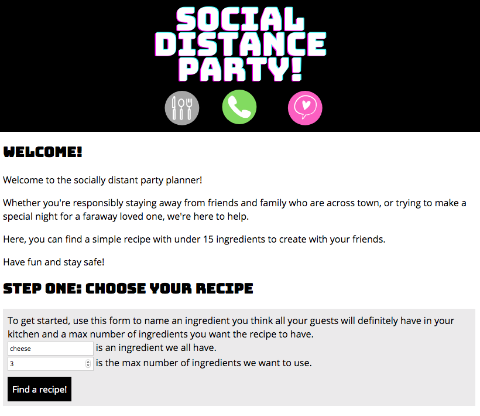

# Social Distance Party!
------------------------

Check out the app here: https://kayleidoscope.github.io/hungry-but-lazy/

## App summary

In these unprecedented times, it can be hard to know what to do when you connect with loved ones over Zoom, FaceTime, or your favorite videochat platform. Enter Social Distance Party! This app can be used to plan a videochat party, complete with recipe search and a sample invite to send to guests.

## Step by step description

In Step One, users will select an ingredient to base their dish around and a maximum number of ingredients to use. They will then have the option to choose between 10 recipes, and they will be moved on to Step Two after selecting a recipe with the "Let's Make It!" button.

In Step Two, users will choose a date, time, and videochat platform to plan their party. They also have the option to designate a time zone.

After Steps One and Two are complete, a sample invite will appear on the screen in Step Three, autofilled with the correct recipe and event information. Users can copy and paste this text to share with friends!

And what's Step Four? It's time to party -- safely!

## Technology

This app uses:
- HTML
- CSS
- JavaScript
- jQuery
- [Edamam's Recipe Search API](https://developer.edamam.com/edamam-recipe-api "See Edamam's API")

## Screenshots

## Author

- Kay Holten - design and frontend development